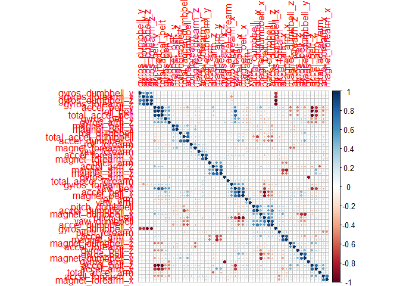
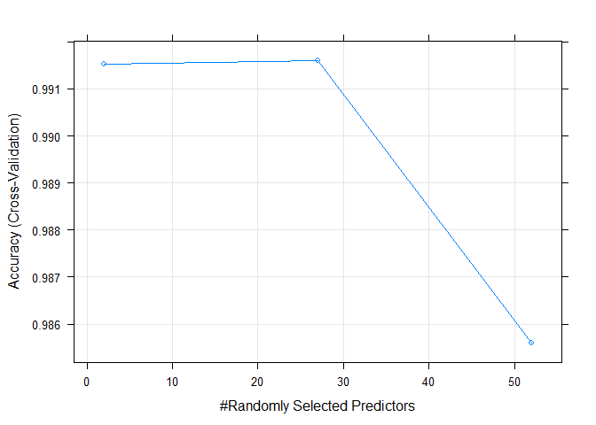

---
title: "ML_Course_Project"
author: "Lee Pena"
date: "February 27, 2018"
output: md_document


#Machine Learnining Project

Background

Using devices such as Jawbone Up, Nike FuelBand, and Fitbit it is now possible to collect a large amount of data about personal activity relatively inexpensively. These type of devices are part of the quantified self movement - a group of enthusiasts who take measurements about themselves regularly to improve their health, to find patterns in their behavior, or because they are tech geeks. One thing that people regularly do is quantify how much of a particular activity they do, but they rarely quantify how well they do it. In this project, your goal will be to use data from accelerometers on the belt, forearm, arm, and dumbell of 6 participants. They were asked to perform barbell lifts correctly and incorrectly in 5 different ways. More information is available from the website here: http://web.archive.org/web/20161224072740/http:/groupware.les.inf.puc-rio.br/har (see the section on the Weight Lifting Exercise Dataset).


```r
#Load all the packages we will need for project
library(caret)
library(randomForest)
library(corrplot)
library(parallel)
library(doParallel)
library(nortest)
```

## Data 

The training data for this project are available here:

https://d396qusza40orc.cloudfront.net/predmachlearn/pml-training.csv

The test data are available here:

https://d396qusza40orc.cloudfront.net/predmachlearn/pml-testing.csv


bring in data and setup up for parallel processing:


```r
cluster <- makeCluster(detectCores() - 1) # convention to leave 1 core for OS
registerDoParallel(cluster)

download.file("https://d396qusza40orc.cloudfront.net/predmachlearn/pml-training.csv", destfile = "ML_project_training.csv")

training <- read.csv("ML_project_training.csv")

download.file("https://d396qusza40orc.cloudfront.net/predmachlearn/pml-testing.csv", destfile = "ML_project_test.csv")

test <-read.csv("ML_project_test.csv")

head(training)
summary(training)
```

# Data Preprocess

Remove first 7 columns for training and test as X appears to just be an index and other columns are just ID's.
Appears to be a large number of na's as well

```r
training <- training[-c(1:7)]

test <- test[-c(1:7)]
```

Checking to see how many complete rows that are in the dataset


```r
training2 <-training[complete.cases(training), ]
dim(training2)
```

```
## [1] 406 153
```
looks like we reduce to very few columns with complete cases so we will need to go another route

replace empty values with NA on training and test set:

```r
training[training==""] = NA
test[test==""] = NA
```

Look at how many NA's are in each column

```r
colSums(is.na(training))
```

```
##                roll_belt               pitch_belt                 yaw_belt 
##                        0                        0                        0 
##         total_accel_belt       kurtosis_roll_belt      kurtosis_picth_belt 
##                        0                    19216                    19216 
##        kurtosis_yaw_belt       skewness_roll_belt     skewness_roll_belt.1 
##                    19216                    19216                    19216 
##        skewness_yaw_belt            max_roll_belt           max_picth_belt 
##                    19216                    19216                    19216 
##             max_yaw_belt            min_roll_belt           min_pitch_belt 
##                    19216                    19216                    19216 
##             min_yaw_belt      amplitude_roll_belt     amplitude_pitch_belt 
##                    19216                    19216                    19216 
##       amplitude_yaw_belt     var_total_accel_belt            avg_roll_belt 
##                    19216                    19216                    19216 
##         stddev_roll_belt            var_roll_belt           avg_pitch_belt 
##                    19216                    19216                    19216 
##        stddev_pitch_belt           var_pitch_belt             avg_yaw_belt 
##                    19216                    19216                    19216 
##          stddev_yaw_belt             var_yaw_belt             gyros_belt_x 
##                    19216                    19216                        0 
##             gyros_belt_y             gyros_belt_z             accel_belt_x 
##                        0                        0                        0 
##             accel_belt_y             accel_belt_z            magnet_belt_x 
##                        0                        0                        0 
##            magnet_belt_y            magnet_belt_z                 roll_arm 
##                        0                        0                        0 
##                pitch_arm                  yaw_arm          total_accel_arm 
##                        0                        0                        0 
##            var_accel_arm             avg_roll_arm          stddev_roll_arm 
##                    19216                    19216                    19216 
##             var_roll_arm            avg_pitch_arm         stddev_pitch_arm 
##                    19216                    19216                    19216 
##            var_pitch_arm              avg_yaw_arm           stddev_yaw_arm 
##                    19216                    19216                    19216 
##              var_yaw_arm              gyros_arm_x              gyros_arm_y 
##                    19216                        0                        0 
##              gyros_arm_z              accel_arm_x              accel_arm_y 
##                        0                        0                        0 
##              accel_arm_z             magnet_arm_x             magnet_arm_y 
##                        0                        0                        0 
##             magnet_arm_z        kurtosis_roll_arm       kurtosis_picth_arm 
##                        0                    19216                    19216 
##         kurtosis_yaw_arm        skewness_roll_arm       skewness_pitch_arm 
##                    19216                    19216                    19216 
##         skewness_yaw_arm             max_roll_arm            max_picth_arm 
##                    19216                    19216                    19216 
##              max_yaw_arm             min_roll_arm            min_pitch_arm 
##                    19216                    19216                    19216 
##              min_yaw_arm       amplitude_roll_arm      amplitude_pitch_arm 
##                    19216                    19216                    19216 
##        amplitude_yaw_arm            roll_dumbbell           pitch_dumbbell 
##                    19216                        0                        0 
##             yaw_dumbbell   kurtosis_roll_dumbbell  kurtosis_picth_dumbbell 
##                        0                    19216                    19216 
##    kurtosis_yaw_dumbbell   skewness_roll_dumbbell  skewness_pitch_dumbbell 
##                    19216                    19216                    19216 
##    skewness_yaw_dumbbell        max_roll_dumbbell       max_picth_dumbbell 
##                    19216                    19216                    19216 
##         max_yaw_dumbbell        min_roll_dumbbell       min_pitch_dumbbell 
##                    19216                    19216                    19216 
##         min_yaw_dumbbell  amplitude_roll_dumbbell amplitude_pitch_dumbbell 
##                    19216                    19216                    19216 
##   amplitude_yaw_dumbbell     total_accel_dumbbell       var_accel_dumbbell 
##                    19216                        0                    19216 
##        avg_roll_dumbbell     stddev_roll_dumbbell        var_roll_dumbbell 
##                    19216                    19216                    19216 
##       avg_pitch_dumbbell    stddev_pitch_dumbbell       var_pitch_dumbbell 
##                    19216                    19216                    19216 
##         avg_yaw_dumbbell      stddev_yaw_dumbbell         var_yaw_dumbbell 
##                    19216                    19216                    19216 
##         gyros_dumbbell_x         gyros_dumbbell_y         gyros_dumbbell_z 
##                        0                        0                        0 
##         accel_dumbbell_x         accel_dumbbell_y         accel_dumbbell_z 
##                        0                        0                        0 
##        magnet_dumbbell_x        magnet_dumbbell_y        magnet_dumbbell_z 
##                        0                        0                        0 
##             roll_forearm            pitch_forearm              yaw_forearm 
##                        0                        0                        0 
##    kurtosis_roll_forearm   kurtosis_picth_forearm     kurtosis_yaw_forearm 
##                    19216                    19216                    19216 
##    skewness_roll_forearm   skewness_pitch_forearm     skewness_yaw_forearm 
##                    19216                    19216                    19216 
##         max_roll_forearm        max_picth_forearm          max_yaw_forearm 
##                    19216                    19216                    19216 
##         min_roll_forearm        min_pitch_forearm          min_yaw_forearm 
##                    19216                    19216                    19216 
##   amplitude_roll_forearm  amplitude_pitch_forearm    amplitude_yaw_forearm 
##                    19216                    19216                    19216 
##      total_accel_forearm        var_accel_forearm         avg_roll_forearm 
##                        0                    19216                    19216 
##      stddev_roll_forearm         var_roll_forearm        avg_pitch_forearm 
##                    19216                    19216                    19216 
##     stddev_pitch_forearm        var_pitch_forearm          avg_yaw_forearm 
##                    19216                    19216                    19216 
##       stddev_yaw_forearm          var_yaw_forearm          gyros_forearm_x 
##                    19216                    19216                        0 
##          gyros_forearm_y          gyros_forearm_z          accel_forearm_x 
##                        0                        0                        0 
##          accel_forearm_y          accel_forearm_z         magnet_forearm_x 
##                        0                        0                        0 
##         magnet_forearm_y         magnet_forearm_z                   classe 
##                        0                        0                        0
```

```r
colSums(is.na(test))
```

```
##                roll_belt               pitch_belt                 yaw_belt 
##                        0                        0                        0 
##         total_accel_belt       kurtosis_roll_belt      kurtosis_picth_belt 
##                        0                       20                       20 
##        kurtosis_yaw_belt       skewness_roll_belt     skewness_roll_belt.1 
##                       20                       20                       20 
##        skewness_yaw_belt            max_roll_belt           max_picth_belt 
##                       20                       20                       20 
##             max_yaw_belt            min_roll_belt           min_pitch_belt 
##                       20                       20                       20 
##             min_yaw_belt      amplitude_roll_belt     amplitude_pitch_belt 
##                       20                       20                       20 
##       amplitude_yaw_belt     var_total_accel_belt            avg_roll_belt 
##                       20                       20                       20 
##         stddev_roll_belt            var_roll_belt           avg_pitch_belt 
##                       20                       20                       20 
##        stddev_pitch_belt           var_pitch_belt             avg_yaw_belt 
##                       20                       20                       20 
##          stddev_yaw_belt             var_yaw_belt             gyros_belt_x 
##                       20                       20                        0 
##             gyros_belt_y             gyros_belt_z             accel_belt_x 
##                        0                        0                        0 
##             accel_belt_y             accel_belt_z            magnet_belt_x 
##                        0                        0                        0 
##            magnet_belt_y            magnet_belt_z                 roll_arm 
##                        0                        0                        0 
##                pitch_arm                  yaw_arm          total_accel_arm 
##                        0                        0                        0 
##            var_accel_arm             avg_roll_arm          stddev_roll_arm 
##                       20                       20                       20 
##             var_roll_arm            avg_pitch_arm         stddev_pitch_arm 
##                       20                       20                       20 
##            var_pitch_arm              avg_yaw_arm           stddev_yaw_arm 
##                       20                       20                       20 
##              var_yaw_arm              gyros_arm_x              gyros_arm_y 
##                       20                        0                        0 
##              gyros_arm_z              accel_arm_x              accel_arm_y 
##                        0                        0                        0 
##              accel_arm_z             magnet_arm_x             magnet_arm_y 
##                        0                        0                        0 
##             magnet_arm_z        kurtosis_roll_arm       kurtosis_picth_arm 
##                        0                       20                       20 
##         kurtosis_yaw_arm        skewness_roll_arm       skewness_pitch_arm 
##                       20                       20                       20 
##         skewness_yaw_arm             max_roll_arm            max_picth_arm 
##                       20                       20                       20 
##              max_yaw_arm             min_roll_arm            min_pitch_arm 
##                       20                       20                       20 
##              min_yaw_arm       amplitude_roll_arm      amplitude_pitch_arm 
##                       20                       20                       20 
##        amplitude_yaw_arm            roll_dumbbell           pitch_dumbbell 
##                       20                        0                        0 
##             yaw_dumbbell   kurtosis_roll_dumbbell  kurtosis_picth_dumbbell 
##                        0                       20                       20 
##    kurtosis_yaw_dumbbell   skewness_roll_dumbbell  skewness_pitch_dumbbell 
##                       20                       20                       20 
##    skewness_yaw_dumbbell        max_roll_dumbbell       max_picth_dumbbell 
##                       20                       20                       20 
##         max_yaw_dumbbell        min_roll_dumbbell       min_pitch_dumbbell 
##                       20                       20                       20 
##         min_yaw_dumbbell  amplitude_roll_dumbbell amplitude_pitch_dumbbell 
##                       20                       20                       20 
##   amplitude_yaw_dumbbell     total_accel_dumbbell       var_accel_dumbbell 
##                       20                        0                       20 
##        avg_roll_dumbbell     stddev_roll_dumbbell        var_roll_dumbbell 
##                       20                       20                       20 
##       avg_pitch_dumbbell    stddev_pitch_dumbbell       var_pitch_dumbbell 
##                       20                       20                       20 
##         avg_yaw_dumbbell      stddev_yaw_dumbbell         var_yaw_dumbbell 
##                       20                       20                       20 
##         gyros_dumbbell_x         gyros_dumbbell_y         gyros_dumbbell_z 
##                        0                        0                        0 
##         accel_dumbbell_x         accel_dumbbell_y         accel_dumbbell_z 
##                        0                        0                        0 
##        magnet_dumbbell_x        magnet_dumbbell_y        magnet_dumbbell_z 
##                        0                        0                        0 
##             roll_forearm            pitch_forearm              yaw_forearm 
##                        0                        0                        0 
##    kurtosis_roll_forearm   kurtosis_picth_forearm     kurtosis_yaw_forearm 
##                       20                       20                       20 
##    skewness_roll_forearm   skewness_pitch_forearm     skewness_yaw_forearm 
##                       20                       20                       20 
##         max_roll_forearm        max_picth_forearm          max_yaw_forearm 
##                       20                       20                       20 
##         min_roll_forearm        min_pitch_forearm          min_yaw_forearm 
##                       20                       20                       20 
##   amplitude_roll_forearm  amplitude_pitch_forearm    amplitude_yaw_forearm 
##                       20                       20                       20 
##      total_accel_forearm        var_accel_forearm         avg_roll_forearm 
##                        0                       20                       20 
##      stddev_roll_forearm         var_roll_forearm        avg_pitch_forearm 
##                       20                       20                       20 
##     stddev_pitch_forearm        var_pitch_forearm          avg_yaw_forearm 
##                       20                       20                       20 
##       stddev_yaw_forearm          var_yaw_forearm          gyros_forearm_x 
##                       20                       20                        0 
##          gyros_forearm_y          gyros_forearm_z          accel_forearm_x 
##                        0                        0                        0 
##          accel_forearm_y          accel_forearm_z         magnet_forearm_x 
##                        0                        0                        0 
##         magnet_forearm_y         magnet_forearm_z               problem_id 
##                        0                        0                        0
```

 looks like rows that have Na's have majority Na's that sum to 19216 across the board.
 removing columns that have Na's tha sum to 19216 in training set
 doing the same for the testing set that has 20 NA per column across the board

```r
training2 <- training[lapply( training, function(x) sum(is.na(x))) == !19216 ]

test2 <- test[lapply( test, function(x) sum(is.na(x))) == !20 ]
dim(training2)
```

```
## [1] 19622    53
```

```r
dim(test2)
```

```
## [1] 20 53
```

#Slice Data
Split training set into training and validation set

```r
inBuild <- createDataPartition(y=training2$classe,
                               p=0.8, list=FALSE)
validation <- training2[-inBuild,];
training3 <- training2[inBuild,]
```

#Model Building

Near Zero Variance variable identification

```r
nsv <- nearZeroVar(training3, saveMetrics = TRUE)
nsv
```

```
##                      freqRatio percentUnique zeroVar   nzv
## roll_belt             1.092798    7.55462131   FALSE FALSE
## pitch_belt            1.050633   11.08987834   FALSE FALSE
## yaw_belt              1.090452   11.86062807   FALSE FALSE
## total_accel_belt      1.051055    0.17835531   FALSE FALSE
## gyros_belt_x          1.057117    0.85355755   FALSE FALSE
## gyros_belt_y          1.132932    0.43314861   FALSE FALSE
## gyros_belt_z          1.068768    1.04465253   FALSE FALSE
## accel_belt_x          1.088816    1.01280336   FALSE FALSE
## accel_belt_y          1.099511    0.88540671   FALSE FALSE
## accel_belt_z          1.081277    1.85362125   FALSE FALSE
## magnet_belt_x         1.120996    2.00012740   FALSE FALSE
## magnet_belt_y         1.081553    1.86636091   FALSE FALSE
## magnet_belt_z         1.002688    2.83457545   FALSE FALSE
## roll_arm             49.254545   15.95643035   FALSE FALSE
## pitch_arm            87.419355   18.48525384   FALSE FALSE
## yaw_arm              33.444444   17.39601248   FALSE FALSE
## total_accel_arm       1.059805    0.42040894   FALSE FALSE
## gyros_arm_x           1.036232    4.03210396   FALSE FALSE
## gyros_arm_y           1.460784    2.33772852   FALSE FALSE
## gyros_arm_z           1.044496    1.52875979   FALSE FALSE
## accel_arm_x           1.042857    4.91114084   FALSE FALSE
## accel_arm_y           1.222892    3.35053188   FALSE FALSE
## accel_arm_z           1.118812    4.94299000   FALSE FALSE
## magnet_arm_x          1.014706    8.49735652   FALSE FALSE
## magnet_arm_y          1.013889    5.52264475   FALSE FALSE
## magnet_arm_z          1.021277    8.03872858   FALSE FALSE
## roll_dumbbell         1.056604   85.43219313   FALSE FALSE
## pitch_dumbbell        2.405660   83.35562775   FALSE FALSE
## yaw_dumbbell          1.092784   85.02452386   FALSE FALSE
## total_accel_dumbbell  1.059688    0.27390280   FALSE FALSE
## gyros_dumbbell_x      1.006110    1.51602013   FALSE FALSE
## gyros_dumbbell_y      1.247917    1.71985477   FALSE FALSE
## gyros_dumbbell_z      1.075157    1.26122683   FALSE FALSE
## accel_dumbbell_x      1.057252    2.68169947   FALSE FALSE
## accel_dumbbell_y      1.026316    2.92375311   FALSE FALSE
## accel_dumbbell_z      1.176166    2.54793299   FALSE FALSE
## magnet_dumbbell_x     1.065217    6.95585706   FALSE FALSE
## magnet_dumbbell_y     1.182482    5.31244028   FALSE FALSE
## magnet_dumbbell_z     1.052980    4.26141792   FALSE FALSE
## roll_forearm         11.699248   12.72055545   FALSE FALSE
## pitch_forearm        64.812500   17.48519014   FALSE FALSE
## yaw_forearm          15.472637   11.72686158   FALSE FALSE
## total_accel_forearm   1.093000    0.44588827   FALSE FALSE
## gyros_forearm_x       1.080097    1.79629276   FALSE FALSE
## gyros_forearm_y       1.006270    4.57990955   FALSE FALSE
## gyros_forearm_z       1.112272    1.82814192   FALSE FALSE
## accel_forearm_x       1.130435    4.96209950   FALSE FALSE
## accel_forearm_y       1.035714    6.31887381   FALSE FALSE
## accel_forearm_z       1.064000    3.58621568   FALSE FALSE
## magnet_forearm_x      1.193548    9.42098223   FALSE FALSE
## magnet_forearm_y      1.084507   11.75871075   FALSE FALSE
## magnet_forearm_z      1.083333   10.44015542   FALSE FALSE
## classe                1.469388    0.03184916   FALSE FALSE
```
no zero variance variables


Check for normality

```r
vars <- names(training3) %in% "classe"
training_temp <- training3[!vars] # remove factor variables as they cannot be used in Anderson Darling normality test

library(nortest)
lshap <- lapply(training_temp, ad.test) # apply normality test to all columns
lres <- sapply(lshap, `[`, c("statistic","p.value"))  # extract the statistic and p value data
transposed_test_results<- t(lres)  # transpose the data to see it in a nice data frame to see if any variable is not normal
transposed_test_results
```

```
##                      statistic p.value
## roll_belt            2160.398  3.7e-24
## pitch_belt           1323.936  3.7e-24
## yaw_belt             1393.142  3.7e-24
## total_accel_belt     1559.043  3.7e-24
## gyros_belt_x         974.5085  3.7e-24
## gyros_belt_y         587.1145  3.7e-24
## gyros_belt_z         638.5926  3.7e-24
## accel_belt_x         1224.81   3.7e-24
## accel_belt_y         1097.137  3.7e-24
## accel_belt_z         1741.114  3.7e-24
## magnet_belt_x        1279.384  3.7e-24
## magnet_belt_y        642.9552  3.7e-24
## magnet_belt_z        815.8126  3.7e-24
## roll_arm             151.2435  3.7e-24
## pitch_arm            109.7685  3.7e-24
## yaw_arm              111.9318  3.7e-24
## total_accel_arm      68.85853  3.7e-24
## gyros_arm_x          96.97239  3.7e-24
## gyros_arm_y          62.68934  3.7e-24
## gyros_arm_z          64.04723  3.7e-24
## accel_arm_x          368.2356  3.7e-24
## accel_arm_y          247.7229  3.7e-24
## accel_arm_z          167.749   3.7e-24
## magnet_arm_x         730.9081  3.7e-24
## magnet_arm_y         262.1287  3.7e-24
## magnet_arm_z         994.9136  3.7e-24
## roll_dumbbell        519.2624  3.7e-24
## pitch_dumbbell       222.6876  3.7e-24
## yaw_dumbbell         506.2765  3.7e-24
## total_accel_dumbbell 481.9183  3.7e-24
## gyros_dumbbell_x     3562.114  3.7e-24
## gyros_dumbbell_y     869.176   3.7e-24
## gyros_dumbbell_z     4565.717  3.7e-24
## accel_dumbbell_x     533.8941  3.7e-24
## accel_dumbbell_y     123.3235  3.7e-24
## accel_dumbbell_z     483.2045  3.7e-24
## magnet_dumbbell_x    1996.934  3.7e-24
## magnet_dumbbell_y    1827.959  3.7e-24
## magnet_dumbbell_z    453.0382  3.7e-24
## roll_forearm         438.7845  3.7e-24
## pitch_forearm        295.3154  3.7e-24
## yaw_forearm          337.5694  3.7e-24
## total_accel_forearm  87.72738  3.7e-24
## gyros_forearm_x      150.9245  3.7e-24
## gyros_forearm_y      560.5973  3.7e-24
## gyros_forearm_z      2756.844  3.7e-24
## accel_forearm_x      66.67162  3.7e-24
## accel_forearm_y      180.0341  3.7e-24
## accel_forearm_z      459.7117  3.7e-24
## magnet_forearm_x     304.4606  3.7e-24
## magnet_forearm_y     733.5701  3.7e-24
## magnet_forearm_z     689.7228  3.7e-24
```
Looks like all variables are normally distributed according to the P values


Looking for correlated variables


```r
M <- abs(cor(training_temp))#calculate the correlation between all those columns. The correlation between all predictor variables. And take its absolute value.

diag(M) <- 0                   #set the diag to zero as it is variable compared to itself
which(M>0.9, arr.ind = T)      #setting correlation threshold to 90 %
```

```
##                  row col
## total_accel_belt   4   1
## accel_belt_y       9   1
## accel_belt_z      10   1
## accel_belt_x       8   2
## roll_belt          1   4
## accel_belt_y       9   4
## accel_belt_z      10   4
## pitch_belt         2   8
## roll_belt          1   9
## total_accel_belt   4   9
## accel_belt_z      10   9
## roll_belt          1  10
## total_accel_belt   4  10
## accel_belt_y       9  10
## gyros_arm_y       19  18
## gyros_arm_x       18  19
## gyros_dumbbell_z  33  31
## gyros_forearm_z   46  31
## gyros_dumbbell_x  31  33
## gyros_forearm_z   46  33
## gyros_dumbbell_x  31  46
## gyros_dumbbell_z  33  46
```

```r
corrplot(cor(training_temp), order = "hclust")
```

<!-- -->


```r
names(training_temp)[c(4,1)]           # get the names of columns that are correlated
#plot(training_temp[,4], training_temp[,1])

names(training_temp)[c(9,1)]           # get the names of columns that are correlated
#plot(training_temp[,9], training_temp[,1])

names(training_temp)[c(8,2)]           # get the names of columns that are correlated
#plot(training_temp[,8], training_temp[,2])

names(training_temp)[c(46,33)]           # get the names of columns that are correlated
#plot(training_temp[,46], training_temp[,33])
```

#Build Model


since we have correlated variables will use random forest as it handles correlated values better than linear regression.  Using Cross Validation in the random forest model build.  Using 5 kfold 

```r
fitControl <- trainControl(method = "cv",
                           number = 5,
                           allowParallel = TRUE)
fit <- train(classe~., data = training3, method="rf",trControl =fitControl)

varImp(fit) 
```

```
## rf variable importance
## 
##   only 20 most important variables shown (out of 52)
## 
##                      Overall
## roll_belt            100.000
## pitch_forearm         60.749
## yaw_belt              53.060
## roll_forearm          43.394
## pitch_belt            43.103
## magnet_dumbbell_y     42.053
## magnet_dumbbell_z     41.893
## accel_dumbbell_y      24.573
## accel_forearm_x       17.486
## magnet_dumbbell_x     16.930
## roll_dumbbell         16.057
## magnet_belt_z         15.614
## accel_dumbbell_z      14.023
## magnet_forearm_z      13.628
## accel_belt_z          13.115
## total_accel_dumbbell  12.850
## magnet_belt_y         12.446
## gyros_belt_z          11.629
## magnet_belt_x          9.731
## yaw_arm                9.724
```

```r
plot(fit)
```

<!-- -->

```r
fit
```

```
## Random Forest 
## 
## 15699 samples
##    52 predictor
##     5 classes: 'A', 'B', 'C', 'D', 'E' 
## 
## No pre-processing
## Resampling: Cross-Validated (5 fold) 
## Summary of sample sizes: 12558, 12561, 12558, 12559, 12560 
## Resampling results across tuning parameters:
## 
##   mtry  Accuracy   Kappa    
##    2    0.9915285  0.9892825
##   27    0.9915920  0.9893633
##   52    0.9856044  0.9817876
## 
## Accuracy was used to select the optimal model using the largest value.
## The final value used for the model was mtry = 27.
```

```r
fit$resample
```

```
##    Accuracy     Kappa Resample
## 1 0.9894938 0.9867073    Fold1
## 2 0.9910856 0.9887241    Fold3
## 3 0.9891651 0.9862904    Fold2
## 4 0.9961771 0.9951651    Fold5
## 5 0.9920382 0.9899295    Fold4
```

```r
confusionMatrix.train(fit)
```

```
## Cross-Validated (5 fold) Confusion Matrix 
## 
## (entries are percentual average cell counts across resamples)
##  
##           Reference
## Prediction    A    B    C    D    E
##          A 28.4  0.2  0.0  0.0  0.0
##          B  0.1 19.1  0.1  0.0  0.0
##          C  0.0  0.0 17.3  0.2  0.0
##          D  0.0  0.0  0.1 16.1  0.1
##          E  0.0  0.0  0.0  0.0 18.3
##                             
##  Accuracy (average) : 0.9916
```

#Test Model on validation set

```r
predict_rf <- predict(fit,validation)
confusionMatrix(predict_rf, validation$classe)
```

```
## Confusion Matrix and Statistics
## 
##           Reference
## Prediction    A    B    C    D    E
##          A 1114    8    0    0    0
##          B    2  746    4    1    0
##          C    0    5  679    2    1
##          D    0    0    1  640    1
##          E    0    0    0    0  719
## 
## Overall Statistics
##                                           
##                Accuracy : 0.9936          
##                  95% CI : (0.9906, 0.9959)
##     No Information Rate : 0.2845          
##     P-Value [Acc > NIR] : < 2.2e-16       
##                                           
##                   Kappa : 0.9919          
##  Mcnemar's Test P-Value : NA              
## 
## Statistics by Class:
## 
##                      Class: A Class: B Class: C Class: D Class: E
## Sensitivity            0.9982   0.9829   0.9927   0.9953   0.9972
## Specificity            0.9971   0.9978   0.9975   0.9994   1.0000
## Pos Pred Value         0.9929   0.9907   0.9884   0.9969   1.0000
## Neg Pred Value         0.9993   0.9959   0.9985   0.9991   0.9994
## Prevalence             0.2845   0.1935   0.1744   0.1639   0.1838
## Detection Rate         0.2840   0.1902   0.1731   0.1631   0.1833
## Detection Prevalence   0.2860   0.1919   0.1751   0.1637   0.1833
## Balanced Accuracy      0.9977   0.9903   0.9951   0.9974   0.9986
```

```r
# predict values on the test set
predict_rf <- predict(fit,test2)
```
The out of sample error is very small given the information above .0074


#Conclusion
The Random Forest method from the caret package automates the process of fitting multiple versions of a given model by varying its parameters and/or folds within a resampling / cross-validation process.  This has lead to a training accuracy of .9926 and a out of sample validation accuracy of .9916

